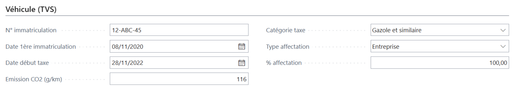
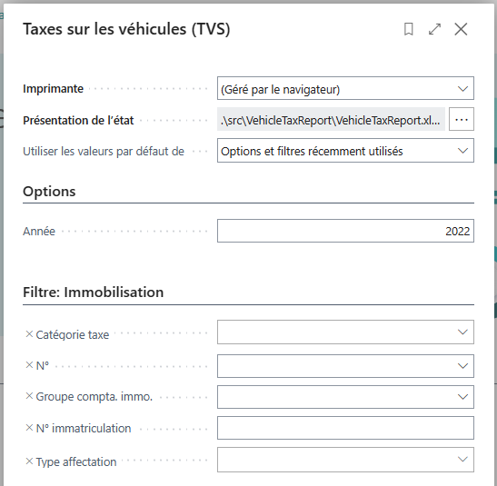
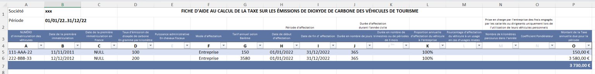
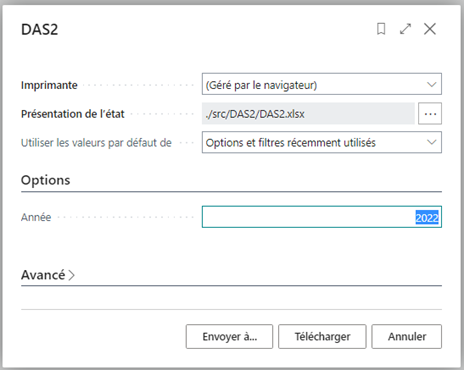
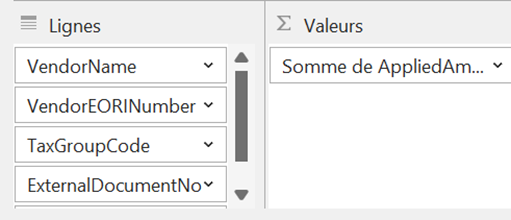
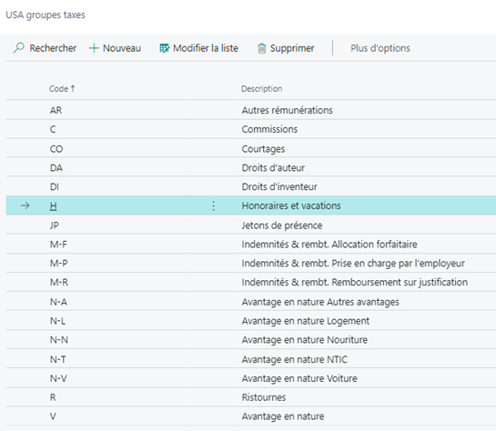
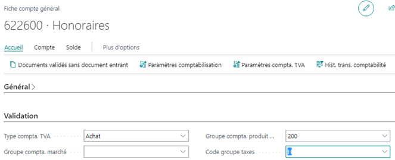
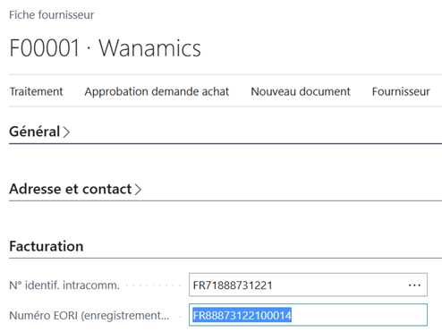

# Extension WanaFrance

Microsoft propose désormais Business Central dans plus de 130 pays (voir [Country/region availability and supported languages – Business Central | Microsoft Learn](https://learn.microsoft.com/en-us/dynamics365/business-central/dev-itpro/compliance/apptest-countries-and-translations)).

Outre la traduction, il s’agit surtout de prendre en compte les spécificités locales.

Ainsi, vous trouverez une page dédiée à la localisation pour la France : [Fonctionnalité locale, France – Business Central | Microsoft Learn](https://learn.microsoft.com/fr-fr/dynamics365/business-central/localfunctionality/france/france-local-functionality)

Il en est cependant quelques unes non couvertes à ce jour, que cette extension permet de prendre en compte en attendant que Microsoft s’en charge (dont télédéclaration peut-être…).

Microsoft a entrepris un chantier de **délocalisation** ayant pour but de dissocier les différentes fonctionnalités afin de faciliter le déploiement international (c’est déjà le cas pour le Danemark et ce le sera très prochainement pour la Suède). Lorsque viendra le tour de la France, outre la réorganisation des fonctions, il est probable que quelques unes seront ‘dépréciées’ et progressivement abandonnées (ex : SIREN et SIRET respectivement remplacés par **N° identif. intracomm.** et **Numéro EORI**).
C’est pourquoi les fonctionnalités ci-après se veulent paradoxalement indépendantes de la localisation française.

- [Déclaration de la taxe sur les véhicules (ex TVS)](#déclaration-de-la-taxe-sur-les-véhicules-ex-tvs)
  - [Fiche immobilisation](#fiche-immobilisation)
  - [Déclaration](#déclaration)
- [Déclaration DAS 2 (honoraires…)](#déclaration-das-2-honoraires)
  - [Utilisation](#utilisation)
  - [Données](#données)
  - [Principe](#principe)
  - [Remarques](#remarques)
  - [Configuration](#configuration)
    - [Plan comptable](#plan-comptable)
    - [Fournisseurs](#fournisseurs)

## Déclaration de la taxe sur les véhicules (ex TVS)
Depuis le 01/01/2023 la déclaration jusqu’alors nommée TVS (Taxe sur les Véhicules de Sociétés) et remplacée par deux déclarations :

* TAXE SUR LES ÉMISSIONS DE DIOXYDE DE CARBONE ([Formulaire n°2857-FC-SD | impots.gouv.fr](https://www.impots.gouv.fr/formulaire/2857-fc-sd/fiche-daide-au-calcul-de-la-taxe-sur-les-emissions-de-dioxyde-de-carbone-des))
* TAXE ANNUELLE SUR L’ANCIENNETÉ DES VÉHICULES DE TOURISME ([Formulaire n°2858-FC-SD | impots.gouv.fr](https://www.impots.gouv.fr/formulaire/2858-fc-sd/fiche-daide-au-calcul-de-la-taxe-sur-lanciennete-des-vehicules-de-tourisme))... difficile de faire plus long 🙂 c’est pourquoi l’acronyme TVS a été conservé !

Outre les liens vers les textes officiels ci-dessus, vous trouverez quelques informations générales [dans cet article](https://m.compta-online.com/comptabilisation-taxe-anciennete-vehicules-taxe-emissions-co2-ao6250).

### Fiche immobilisation

Une section est ajoutée à la fiche immobilisation :

Il est bien sûr possible de créer une fiche immobilisation pour un véhicule même s’il n’est pas comptablement immobilisé (en particulier pour les véhicules en Location Longue Durée).

### Déclaration

Recherchez TVS et indiquez la période en **Filtre date compta. immo.** (ex : 01/01/2022..31/12/2022).

L’action Télécharger génère un fichier Excel personnalisé (Excel Layout).

Les feuilles 2857-FC-SD et 2858-FC-SD correspondent respectivement aux 2 déclarations.

Attention, seules les 2 premières lignes sont affichées.
Il faut donc insérer autant de lignes que nécessaires avant la ligne de totalisation.
S’agissant d’un tableau, les formules sont implicitement reportées sur les lignes ainsi insérées.

La feuille ‘Data’ (masquée) reprend les données provenant de Business Central.

Les feuilles reprenant les barèmes (masquées) devront être mises à jour chaque année (voir [Article L421-120 – Code des impositions sur les biens et services – Légifrance (legifrance.gouv.fr)](https://www.legifrance.gouv.fr/codes/article_lc/LEGIARTI000044602983))

Ces déclarations concernent tous les **véhicules affectés à des fins économiques** même ceux n’appartenant pas à l’entreprise (leasing ou remboursement kilométrique aux salariés).

## Déclaration DAS 2 (honoraires…)
La DAS 2 est une déclaration à transmettre aux services fiscaux par tout professionnel (personne physique ou société) versant des honoraires, des commissions, des remises commerciales, des droits d’auteurs ou d’inventeurs (brevets ) de plus de 1.200 euros à des tiers ([DAS 2 : qui est concerné, pourquoi et comment la remplir ? (l-expert-comptable.com)](https://www.l-expert-comptable.com/a/530279-qui-doit-faire-une-das-2-quoi-sert-elle.html#:~:text=La%20DAS%202%20est%20une,1.200%20euros%20%C3%A0%20des%20tiers.)).

La déclaration (Cf. [impot.gouv.fr via le formulaire Cerfa n°12303*12](https://www.wanamics.fr/extension-wanafrance/Formulaire%20n%C2%B0DAS2%20%7C%20impots.gouv.fr)) reprend le nom du bénéficiaire, sa raison sociale, sa profession, son numéro SIRET, le montant et nature des sommes versées.

Voir aussi [Dans quels cas effectuer une déclaration d’honoraires ou de commissions ? | entreprendre.service-public.fr](https://entreprendre.service-public.fr/vosdroits/F31431).

Le traitement proposé ci-après n’a pas pour objet d’en respecter la forme mais d’extraire les informations nécessaires qui (via un tableau croisé dynamique par exemple) permettront de compléter la déclaration.

### Utilisation
Recherchez **DAS2** et indiquez l’année :

L’action Télécharger génère un fichier Excel.

La **Présentation de l’état** peut être personnalisée (Excel Layout), en particulier pour insérer un tableau croisé dynamique défini comme suit :

### Données
|||
|----------------|------------------------------|
|VendorName|Nom du fournisseur|
|VendorEORINumber|	Cf. configuration fournisseur (N° SIRET précédé de FR)|
|TaxGroupCode|	Nature des sommes versées (Cf. configuration plan comptable)|
|ExternalDocumentNo|	N° doc. Externe (facture fournisseur)
|AppliedAmountLCY|	Montant réglé (part relative à l’écriture concernée)
|PaymentDate|	Date du paiement|||

### Principe
Partant des comptes ayant un **Code groupe taxes**, lire les **Ecritures comptabilité** de chacun d’eux

Pour chacune, recherche de **Ecriture fournisseur** (via **N° document** et **Date comptabilisation**, comme pour la fonction **Recherche écritures**)

Recherche des écritures lettrées correspondantes pour déterminer si  la **Date comptabilisation** concerne l’année sélectionnée.

### Remarques

* Le paiement doit passer via le compte fournisseur (une écriture du compte de charge au compte bancaire ne serait pas prise en compte).
* En cas de régularisation de compte à compte, il faudra veiller à reprendre les mêmes **N° document** et **Date comptabilisation**.
* L’analyse est basée sur le lettrage. L’annulation d’une facture par un avoir (lettrée avec celui-ci) est donc prise en compte mais neutre.
* Le paiement groupé de plusieurs factures est éclaté sur chacune des factures.
* En cas de règlement en plusieurs fois d’une même facture, celle-ci sera reprise sur autant de lignes (pour les paiements de l’année sélectionnée).
* Les fournisseurs étrangers (UE ou hors UE) ne sont pas dissociés mais pourront être différenciés (donc filtrés) par le préfixe de leur numéro EORI.
* Les factures en devises sont prises en compte pour leur contrevaleur en devise société le cas échéant.
* Un **Code groupe taxes** (Cf. Configuration) peut être associés au comptes d’immobilisation susceptibles d’inclure des natures relatives à la DAS2 (honoraires d’architecte).
Une nature dédiée peut être définie en vue d’une analyse plus détaillée.
* L’adresse des bénéficiaires n’est pas reprise dans le fichier Excel mais pourra être complétée à l’aide des informations de la fiche fournisseur.
* La profession des bénéficiaires ne figure pas sur la fiche fournisseur, mais le champ **Fonction** de la fiche contact associée (de type société) peut être utilisé à cet effet.

### Configuration
#### Plan comptable
La liste des **Groupe taxes** est utilisée pour définir les natures :

Elles peuvent alors être associées aux comptes concernés :

Il faudra donc créer autant de comptes que nécessaire pour distinguer les différentes natures de la DAS2 (généralement de racines 611 et 622). Il pourra être utile de faire de même pour quelques comptes d’immobilisation.

#### Fournisseurs
Pour une société française, le **Numéro EORI** n’est autre que le SIRET précédé de ‘FR’ (le champ **N° SIRET**,  propre à la localisation FR, n’a pas été retenu pour éviter la dépendance à celle-ci).

